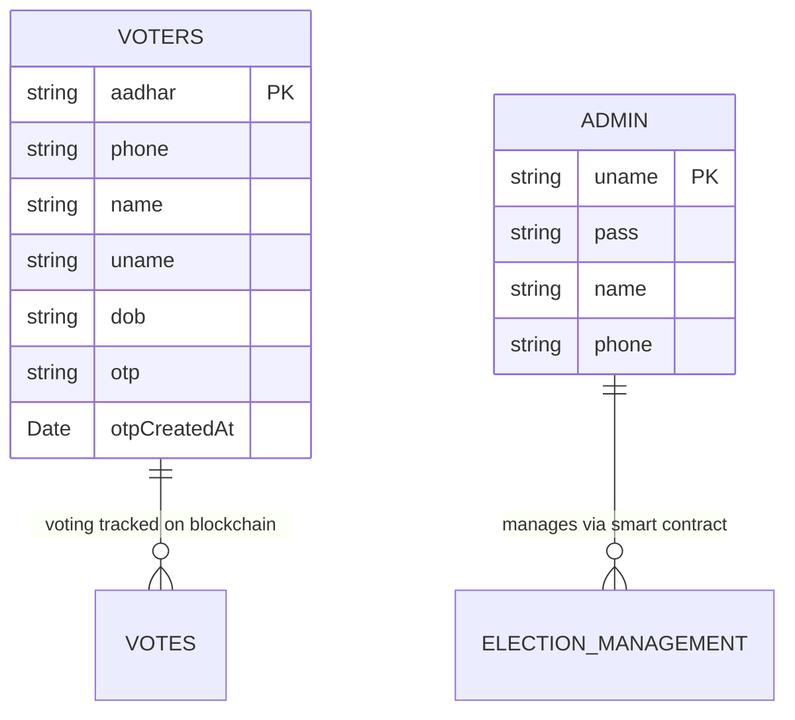
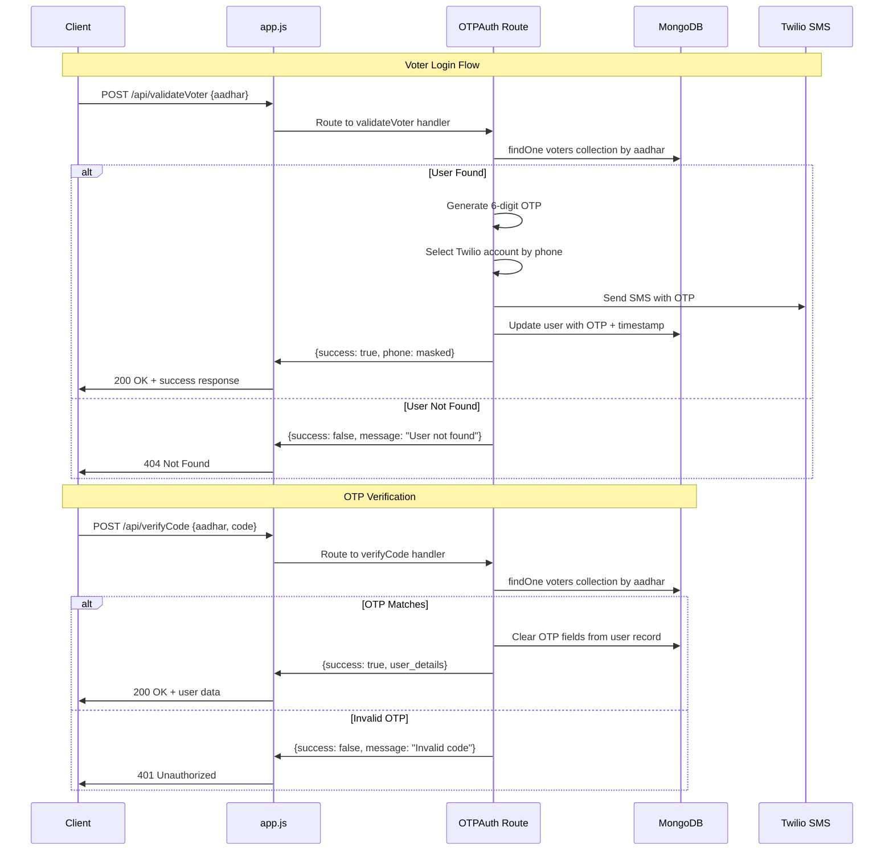

# Backend Deep Dive Report

## 1) Architecture & Boot

### Backend Entry Point
- **Main File**: `backend/app.js` (lines 1-27)
- **Boot Order**:
  1. Load environment variables via `dotenv`
  2. Connect to MongoDB via `connectDB()`
  3. Initialize Express middleware (CORS, body-parser, CSP headers)
  4. Mount API routes (`/api` prefix)
  5. Start server on PORT 3001

### Runtime Modes
- **Single Environment**: Only development mode detected
- **Port Configuration**: `process.env.PORT || 3001` (`app.js:7`)
- **Database**: `process.env.MONGO_URI` from `.env` file (`config/db.js:5`)

### Dependency Injection
- **None**: No DI container or service injection pattern
- **Direct Imports**: Simple require-based module loading
- **Database Access**: Direct mongoose connection usage

## 2) Routing → Controllers → Services → Data Layer

### Route Catalog

| Method | Path | Controller/Handler | Middleware | Auth? | Input (schema) | Output (shape) | Errors | Source File |
|--------|------|-------------------|------------|-------|---------------|----------------|--------|-------------|
| POST | `/api/validateVoter` | OTPAuth.validateVoter | body-parser | ❌ | `{aadhar: string}` | `{success: boolean, message: string, phone?: string}` | 404, 400, 500 | `routes/OTPAuth.js:8` |
| POST | `/api/verifyCode` | OTPAuth.verifyCode | body-parser | ❌ | `{aadhar: string, code: string}` | `{success: boolean, message: string, name?: string, email?: string, dob?: string, phone?: string}` | 401, 500 | `routes/OTPAuth.js:53` |
| GET | `/api/validateAdmin/:name/:pass` | validateAdmin.validate | none | ❌ | URL params: `name, pass` | `{status: boolean, name?: string, email?: string, phone?: string}` | 400, 500 | `routes/validateAdmin.js:7` |

### Controller Responsibilities
- **OTPAuth Controller** (`routes/OTPAuth.js`):
  - Voter validation via Aadhaar lookup
  - OTP generation and SMS delivery via Twilio
  - OTP verification and cleanup
- **Admin Validation Controller** (`routes/validateAdmin.js`):
  - Simple credential verification against admin collection

### Business Logic Location
- **In Controllers**: All business logic is embedded directly in route handlers
- **No Service Layer**: Missing abstraction between routes and data access
- **No Domain Models**: Direct database queries via mongoose collections

### Data Access Pattern
- **Raw MongoDB Collections**: Direct `mongoose.connection.db.collection()` usage
- **No ORM/ODM Models**: Not using Mongoose schemas/models
- **No Repository Pattern**: Database queries scattered in controllers
- **No Transactions**: No atomic operations or transaction handling

## 3) Models & Schema

### Database Collections (Inferred from Code)

| Collection | Fields (inferred from queries) | Constraints | Indexes | Relations | Source Reference |
|------------|--------------------------------|-------------|---------|-----------|------------------|
| `voters` | `aadhar: string, phone: string, name: string, uname: string, dob: string, otp?: string, otpCreatedAt?: Date` | None defined | None visible | None | `routes/OTPAuth.js:11,31` |
| `admin` | `uname: string, pass: string, name: string, phone: string` | None defined | None visible | None | `routes/validateAdmin.js:9` |

### Model Relationship Diagram


**Note**: No formal schema definitions found. Collections appear to be schema-less with field structure inferred from application queries.

## 4) Middleware & Cross-Cutting

### Authentication & Authorization
- **Voter Auth**: Two-step OTP via SMS (Twilio)
  - Step 1: `POST /api/validateVoter` - Aadhaar lookup + OTP generation
  - Step 2: `POST /api/verifyCode` - OTP verification
- **Admin Auth**: Basic credential check via URL parameters (`validateAdmin.js:7`)
- **No JWT/Sessions**: Stateless authentication per request
- **No RBAC/ABAC**: Simple boolean success/failure

### Validation & Sanitization
- **Input Validation**: ❌ None implemented
- **SQL Injection Protection**: ✅ Using MongoDB (NoSQL)
- **XSS Protection**: ❌ No input sanitization
- **CSRF Protection**: ❌ Not implemented

### Error Handling Strategy
- **Pattern**: Try-catch blocks with status code responses
- **Error Shapes**:
  ```javascript
  // Success: {success: true, message: string, ...data}
  // Error: {success: false, message: string}
  ```
- **Logging**: Basic `console.error()` only (`OTPAuth.js:46,72`)
- **No Centralized Handler**: Error handling repeated in each route

### Security Headers
- **CSP**: Basic Content Security Policy in `app.js:15-18`
- **CORS**: Enabled for all origins (`app.js:13`)

### Background Services
- **None**: No job queues, schedulers, or background workers
- **External APIs**: Twilio SMS service integration only

## 5) Config & Ops

### Environment Variables

| Key | Purpose | Default | Source | Required |
|-----|---------|---------|--------|----------|
| `PORT` | Server port | `3001` | `app.js:7` | ❌ |
| `MONGO_URI` | MongoDB connection | none | `config/db.js:5`, `.env:1` | ✅ |
| `TWILIO_PHONE_NUMBER_1/2/3` | Twilio phone numbers | none | `routes/OTPAuth.js:6` | ✅ |
| `ACCOUNT_SID_1/2/3` | Twilio account SIDs | none | `routes/OTPAuth.js:6` | ✅ |
| `AUTH_TOKEN_1/2/3` | Twilio auth tokens | none | `routes/OTPAuth.js:6` | ✅ |

### Startup Commands
```bash
# Development (inferred)
cd backend
npm install
npm start  # Likely uses nodemon based on package.json dependency

# Production (no config found)
node app.js
```

### Docker & Deployment
- **No Containerization**: No Dockerfile or docker-compose.yml
- **No CI/CD**: No deployment automation detected

### Database Management
- **Connection**: MongoDB via Mongoose (`config/db.js`)
- **Migrations**: ❌ None implemented
- **Seed Data**: ❌ No seed scripts found
- **Backup Strategy**: ❌ Not implemented

## 6) Tests

**❌ No Test Suite Found**
- No test files, directories, or frameworks detected
- No test scripts in `package.json`
- No test coverage configuration

## 7) Performance & Security Notes

### Performance Risks
- **N+1 Queries**: Not applicable (simple single-document lookups)
- **Missing Indexes**: No database indexes configured
- **Connection Pooling**: Default mongoose connection (single connection)
- **Caching**: ❌ No caching strategy implemented

### Security Vulnerabilities

| Issue | Severity | Location | Impact |
|-------|----------|----------|--------|
| **Plaintext Password Storage** | 🔴 Critical | `validateAdmin.js:9` | Admin credential compromise |
| **URL Parameter Credentials** | 🔴 Critical | `validateAdmin.js:7` | Credentials in access logs |
| **No Input Validation** | 🟡 Medium | All routes | Data integrity issues |
| **Multiple Twilio Accounts** | 🟡 Medium | `OTPAuth.js:17-31` | Complexity & key management |
| **Open CORS Policy** | 🟡 Medium | `app.js:13` | Cross-origin abuse |
| **No Rate Limiting** | 🟡 Medium | All routes | OTP spam/brute force |

### Security Recommendations
1. **Hash admin passwords** with bcrypt
2. **Move admin auth to POST body** instead of URL params
3. **Add input validation** middleware (joi/express-validator)
4. **Implement rate limiting** for OTP endpoints
5. **Add request logging** middleware

## 8) Backend Data Flow Diagram



---

## Analysis Summary

### Architecture Pattern
**Simple MVC without M**: This backend follows a basic Express.js pattern with Controllers (route handlers) and Views (JSON responses), but lacks formal Models or service layers.

### Key Strengths
- ✅ Simple, understandable codebase
- ✅ Working OTP authentication flow
- ✅ MongoDB integration via Mongoose
- ✅ CORS enabled for frontend integration

### Critical Weaknesses
- 🔴 **Security vulnerabilities** (plaintext passwords, URL params)
- 🔴 **No formal data models** or validation
- 🔴 **No error handling strategy**
- 🔴 **No testing coverage**
- 🔴 **No logging or monitoring**

### Technical Debt
1. **Database Layer**: Replace raw collection queries with Mongoose models
2. **Authentication**: Implement proper password hashing and JWT tokens
3. **Validation**: Add input validation middleware
4. **Error Handling**: Centralized error handling middleware
5. **Testing**: Unit and integration test suite
