```mermaid
graph TD
    %% Root Level
    App[App.jsx<br/>Route Manager]
    
    %% Main Route Branches
    App --> Landing[Landing.jsx<br/>Public Routes]
    App --> VoterDash[VoterDashboard.jsx<br/>Protected Voter Area]
    App --> AdminDash[AdminDashboard.jsx<br/>Protected Admin Area]
    
    %% Route Guards
    VoterGuard[VoterPrivateRoute.jsx<br/>Auth Guard]
    AdminGuard[AdminPrivateRoute.jsx<br/>Auth Guard]
    
    App -.-> VoterGuard
    App -.-> AdminGuard
    VoterGuard --> VoterDash
    AdminGuard --> AdminDash
    
    %% Landing Page Components
    Landing --> NavBar[NavBar.jsx<br/>Navigation Header]
    Landing --> Home[Home.jsx<br/>Landing Content]
    Landing --> About[About.jsx<br/>Static Page]
    Landing --> Contact[Contact.jsx<br/>Static Page]
    Landing --> AdminLogin[AdminLogin.jsx<br/>Admin Auth Page]
    Landing --> VoterLogin[VoterLogin.jsx<br/>Voter Auth Page]
    Landing --> NotFound[NotFound.jsx<br/>404 Page]
    
    %% Authentication Components
    AdminLogin --> AdminLoginComp[AdminLoginComponent.jsx<br/>Admin Auth Form]
    VoterLogin --> VoterLoginComp[VoterLoginComponent.jsx<br/>OTP Auth Form]
    
    %% Voter Dashboard Components
    VoterDash --> VoterHome[VoterHome.jsx<br/>Profile Display]
    VoterDash --> VoteNow[VoteNow.jsx<br/>Blockchain Voting]
    
    %% Admin Dashboard Components
    AdminDash --> AdminHome[AdminHome.jsx<br/>Admin Profile]
    AdminDash --> Controls[Controls.jsx<br/>Election Controls]
    AdminDash --> AddCandidate[AddCandidate.jsx<br/>Candidate Management]
    AdminDash --> AllCandidates[AllCandidates.jsx<br/>Candidate List]
    
    %% External Dependencies
    VoteNow --> Blockchain[Smart Contract<br/>Elections.sol]
    VoteNow --> MetaMask[MetaMask Wallet<br/>Web3 Provider]
    Controls --> Blockchain
    AddCandidate --> Blockchain
    
    VoterLoginComp --> BackendAPI[Backend API<br/>localhost:3001]
    AdminLoginComp --> BackendAPI
    
    %% State Management (localStorage)
    VoterLoginComp -.-> LocalStorage[localStorage<br/>voterData]
    AdminLoginComp -.-> LocalStorage2[localStorage<br/>adminData]
    VoterGuard -.-> LocalStorage
    AdminGuard -.-> LocalStorage2
    
    %% Styling System
    NavBar --> Tailwind[Tailwind CSS<br/>Utility Classes]
    VoterDash --> Tailwind
    AdminDash --> Tailwind
    
    %% Component Types Legend
    classDef smartComponent fill:#e1f5fe,stroke:#01579b,stroke-width:2px
    classDef dumbComponent fill:#f3e5f5,stroke:#4a148c,stroke-width:2px
    classDef routeGuard fill:#fff3e0,stroke:#e65100,stroke-width:2px
    classDef external fill:#e8f5e8,stroke:#2e7d32,stroke-width:2px
    
    %% Apply Styles
    class App,VoterDash,AdminDash,VoterLoginComp,AdminLoginComp,VoteNow,Controls,AddCandidate smartComponent
    class NavBar,Home,About,Contact,NotFound,VoterHome,AdminHome,AllCandidates dumbComponent
    class VoterGuard,AdminGuard routeGuard
    class Blockchain,MetaMask,BackendAPI,LocalStorage,LocalStorage2,Tailwind external
```

**Component Tree Analysis:**

## Component Categories

### 🔵 Smart Components (State + Side Effects)
- **App.jsx**: Route management, conditional styling
- **Dashboard Components**: VoterDashboard, AdminDashboard (sidebar navigation)
- **Auth Components**: VoterLoginComponent, AdminLoginComponent (API calls, form handling)
- **Business Logic**: VoteNow, Controls, AddCandidate (blockchain integration)

### 🟣 Dumb Components (Presentation Only)
- **Static Pages**: Home, About, Contact, NotFound
- **UI Components**: NavBar (navigation links)
- **Display Components**: VoterHome, AdminHome (profile display)

### 🟠 Route Guards (Authentication Logic)
- **VoterPrivateRoute**: Checks `localStorage.voterData.isLogin`
- **AdminPrivateRoute**: Checks `localStorage.adminData.isLogin`

### 🟢 External Dependencies
- **Smart Contract**: Elections.sol (blockchain voting logic)
- **MetaMask**: Web3 wallet integration
- **Backend API**: Express.js authentication server
- **localStorage**: Client-side auth persistence
- **Tailwind CSS**: Utility-first styling framework

## Component Communication Patterns

### Data Flow
1. **Top-Down**: App → Dashboard → Child components
2. **Local State**: Each smart component manages own state (no props drilling)
3. **External State**: localStorage for auth, smart contract for voting data
4. **Side Effects**: useEffect hooks for API calls and blockchain interactions

### State Management
- **No Global State**: No Redux, Context API, or Zustand
- **Local useState**: Component-level state management
- **Persistent State**: localStorage for authentication
- **External State**: Smart contract state for voting data

## Reusability & Composition

### Reusable Patterns
- **Dashboard Layout**: Similar sidebar + content pattern for both admin/voter
- **Auth Components**: Shared pattern for form handling and validation
- **Route Protection**: Reusable guard pattern for different user types

### Missing Abstractions
- ❌ **Shared UI Components**: No button, input, or modal abstractions
- ❌ **Layout Components**: Dashboard layout duplication
- ❌ **Form Components**: Manual form handling in each component
- ❌ **Error Handling**: No error boundary or toast components

## Recommended Improvements
1. **Extract Shared Components**: Button, Input, Modal, Layout wrappers
2. **Add Error Boundaries**: Catch and display component errors gracefully
3. **Create API Client**: Centralize fetch logic and error handling
4. **Implement Global State**: Use Context API or Redux for shared state
5. **Add Loading States**: Spinner components for async operations
