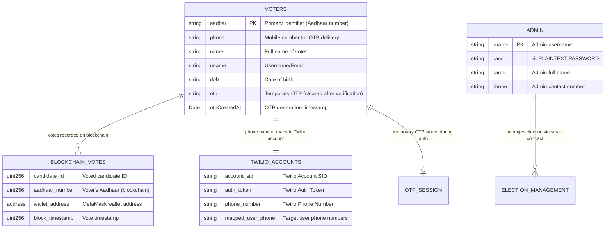

**Schema Notes:**

1. **No Formal Schema**: Collections are schema-less with structure inferred from application code
2. **Missing Constraints**: No validation, unique constraints, or indexes defined
3. **Security Issues**: 
   - Admin passwords stored in plaintext
   - No password policies or rotation
4. **Temporary Data**: OTP fields are created/destroyed during authentication flow
5. **External Dependencies**:
   - Twilio account mapping hardcoded in application logic
   - Blockchain voting data not stored in backend (handled by smart contract)
6. **Data Integrity Risks**:
   - No referential integrity between collections
   - No audit trail for data changes
   - No backup or recovery strategy visible
