```mermaid
sequenceDiagram
    participant U as User
    participant F as Frontend (React)
    participant B as Backend (Express)
    participant DB as MongoDB
    participant T as Twilio SMS
    participant M as MetaMask
    participant SC as Smart Contract
    participant BC as Blockchain Network

    Note over U,BC: Complete End-to-End Voter Journey

    %% Landing & Authentication Phase
    rect rgb(240, 248, 255)
        Note over U,DB: Phase 1: Traditional Authentication
        U->>F: Navigate to /voterLogin
        F->>F: Check localStorage.voterData
        U->>F: Enter Aadhaar number (12 digits)
        F->>F: Validate format client-side
        
        U->>F: Click "Log In"
        F->>B: POST /api/validateVoter {aadhar}
        B->>DB: findOne(voters, {aadhar})
        DB-->>B: User document {aadhar, phone, name, etc}
        
        B->>B: Generate random 6-digit OTP
        B->>B: Select Twilio account by phone mapping
        B->>T: Send SMS with OTP
        T-->>B: Delivery confirmation
        B->>DB: Update user {otp, otpCreatedAt}
        B-->>F: {success: true, phone: "masked"}
        
        F->>F: Show OTP input field
        U->>F: Enter received OTP
        U->>F: Click "Verify OTP"
        
        F->>B: POST /api/verifyCode {aadhar, code}
        B->>DB: findOne(voters, {aadhar})
        B->>B: Validate OTP matches & not expired
        B->>DB: Clear OTP fields from user
        B-->>F: {success: true, profile_data}
        
        F->>F: Store localStorage.voterData {isLogin: true, ...profile}
        F->>F: navigate("/voterDashboard")
    end

    %% Dashboard & Blockchain Connection Phase
    rect rgb(240, 255, 240)
        Note over F,SC: Phase 2: Blockchain Integration
        F->>F: VoterDashboard renders
        F->>F: VoterPrivateRoute checks localStorage
        U->>F: Click "Vote Now" in sidebar
        
        F->>F: VoteNow component useEffect()
        F->>M: connectToBlockchain() - window.ethereum
        M->>U: Show MetaMask connection prompt
        U->>M: Approve wallet connection
        M-->>F: Return connected account address
        
        F->>SC: new web3.eth.Contract(ABI, contractAddress)
        
        par Parallel Blockchain Queries
            F->>SC: getCandidates()
            SC-->>F: Candidate[] with vote counts
        and
            F->>SC: isElectionStarted()
            SC-->>F: boolean election status
        and
            F->>SC: resultStatus()
            SC-->>F: boolean results declared
        and
            F->>SC: checkIfVoted(aadhaar)
            SC-->>F: boolean user voted status
        end
        
        F->>F: Update component state with fetched data
        F->>F: Conditionally render UI based on election status
    end

    %% Voting Transaction Phase
    rect rgb(255, 240, 240)
        Note over U,BC: Phase 3: Blockchain Voting
        alt Election Active AND User Not Voted
            F->>F: Display candidate cards with "Vote Now" buttons
            U->>F: Click "Vote Now" for selected candidate
            
            F->>SC: addVote(candidateId, aadhaarNumber)
            SC->>M: Initiate blockchain transaction
            M->>U: Transaction confirmation popup
            Note right of M: Shows gas fee, transaction details
            
            U->>M: Approve transaction
            M->>BC: Submit transaction to blockchain
            BC->>SC: Execute smart contract method
            
            SC->>SC: Validate conditions:
            Note right of SC: • msg.sender not in voters mapping<br/>• aadhaar not in aadhaarUsed mapping<br/>• candidateId valid range
            
            SC->>SC: Record vote:
            Note right of SC: • Set voters[wallet] = true<br/>• Set aadhaarUsed[aadhaar] = true<br/>• Increment candidate.voteCount<br/>• Add to votersArr[]
            
            BC-->>M: Transaction confirmed
            M-->>F: Vote success callback
            
            F->>F: setHasVotedState(true)
            F->>F: Hide "Vote Now" buttons
            F->>SC: getVoterChoice(walletAddress)
            SC-->>F: Party name string
            F->>F: Display "You voted for {party}"
            
        else Election Not Started
            F->>F: Display "Elections have not started"
        else User Already Voted
            F->>SC: getVoterChoice(walletAddress)
            SC-->>F: Previously voted party name
            F->>F: Display voting status message
        end
    end

    %% Admin Control & Results Phase
    rect rgb(255, 248, 240)
        Note over U,BC: Phase 4: Election Management (Admin Flow)
        Note over U: Alternative path: Admin user
        
        U->>F: Admin login via /adminLogin
        F->>B: GET /api/validateAdmin/{user}/{pass}
        Note right of F: ⚠️ Security risk: credentials in URL
        B->>DB: find(admin, {uname, pass}) - plaintext comparison
        B-->>F: Admin profile data
        F->>F: Store localStorage.adminData, navigate to dashboard
        
        U->>F: Navigate to "Controls" in admin sidebar
        F->>M: Connect admin wallet to MetaMask
        
        alt Start Election
            U->>F: Click "Start Election"
            F->>SC: startElection()
            SC->>SC: Verify msg.sender == owner
            SC->>SC: Set electionStarted = true
            BC-->>F: Transaction confirmed
            F->>F: Update UI state
        end
        
        alt Declare Results (after voting period)
            U->>F: Click "Declare Results"
            F->>SC: declareResults()
            SC->>SC: Calculate winner (max votes)
            SC->>SC: Set isResultDeclared = true, electionStarted = false
            SC-->>F: Winner candidate object
            F->>F: localStorage.setItem('electionResults', winner)
            F->>F: Display results
        end
    end

    %% Results Display Phase
    rect rgb(248, 255, 248)
        Note over F,SC: Phase 5: Results Viewing (All Users)
        F->>SC: resultStatus() - check if declared
        
        alt Results Declared
            F->>SC: getWinner()
            SC-->>F: Winner candidate with vote count
            F->>F: Display winner card with:
            Note right of F: • Candidate name & party<br/>• Final vote count<br/>• Party logo<br/>• "Winner!" designation
        else Results Not Declared
            F->>F: Display "Please wait for results"
        end
    end

    Note over U,BC: System Architecture Notes
    Note over F: • localStorage bridges traditional & Web3 auth
    Note over B,T: • Backend handles OTP via Twilio SMS
    Note over M,SC: • MetaMask manages wallet & transactions
    Note over SC,BC: • Smart contract enforces voting rules
    Note over F: • No real-time updates (manual refresh required)
```

**Key System Integration Points:**

1. **Dual Authentication Bridge**: Traditional backend auth (OTP) connects to Web3 auth (wallet)
2. **State Synchronization**: localStorage maintains user state across page refreshes
3. **Transaction Lifecycle**: React UI → MetaMask → Blockchain → Smart Contract → State Update
4. **Election Control**: Admin actions propagate through smart contract to all user interfaces
5. **Security Boundaries**: Backend validates identity, smart contract validates voting rules

**Critical Dependencies:**
- **MetaMask Availability**: Required for all blockchain interactions
- **Twilio Service**: Critical for voter authentication via SMS
- **MongoDB Connectivity**: Backend auth depends on database availability
- **Smart Contract Deployment**: Must be deployed and accessible on target network
- **Browser Compatibility**: Requires modern browser with Web3 support
