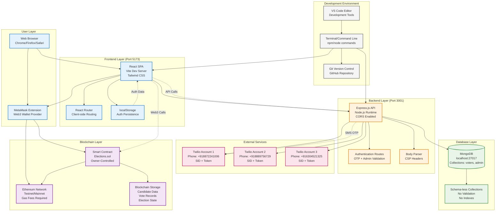
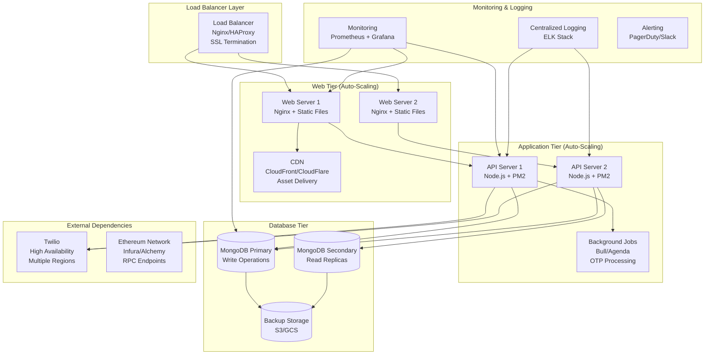
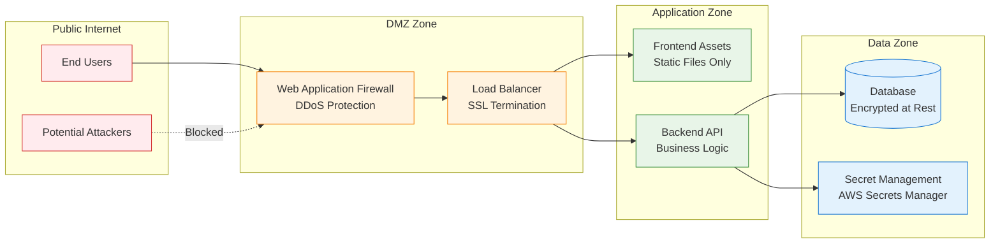
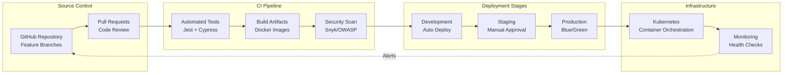

**Production Deployment Topology Requirements:**

## Current Development Setup

### Development Stack (localhost)
- **Frontend**: Vite dev server (localhost:5173)
- **Backend**: Node.js server (localhost:3001)
- **Database**: Local MongoDB (localhost:27017)
- **Blockchain**: MetaMask → Ethereum testnet/mainnet
- **SMS**: 3 Twilio accounts for OTP delivery

### Production Architecture Needs

## Network & Security Architecture

### Port Configuration

| Service | Port | Protocol | Access |
|---------|------|----------|--------|
| **Frontend (Dev)** | 5173 | HTTP | Public |
| **Frontend (Prod)** | 80/443 | HTTP/HTTPS | Public |
| **Backend API** | 3001 | HTTP | Internal |
| **MongoDB** | 27017 | TCP | Internal |
| **Health Checks** | 3000 | HTTP | Internal |

### Security Boundaries

### Infrastructure Requirements

| Component | Development | Production |
|-----------|-------------|------------|
| **Compute** | Local machine | 2+ EC2/VM instances |
| **Storage** | Local disk | EBS/Persistent disks |
| **Network** | Localhost | VPC with subnets |
| **DNS** | localhost:ports | Domain + Route53/CloudDNS |
| **SSL/TLS** | None | Let's Encrypt/Commercial cert |
| **Backup** | Manual | Automated daily backups |
| **Monitoring** | Console logs | Prometheus + Grafana |
| **Secrets** | .env files | Secret management service |

### Deployment Pipeline Architecture

**Missing Production Components:**
1. **Container Orchestration**: No Docker/Kubernetes setup
2. **Service Discovery**: No automatic service registration
3. **Circuit Breakers**: No failure isolation mechanisms
4. **Rate Limiting**: No API rate limiting implementation
5. **Caching Layer**: No Redis/Memcached for performance
6. **Message Queues**: No async processing for OTP/emails
7. **Database Clustering**: No high availability setup
8. **Disaster Recovery**: No cross-region backup strategy
