# Frontend Deep Dive Report

## 1) App Boot & Structure

### Entry Points & Root Renderer
- **Entry File**: `frontend/src/main.jsx` (lines 1-11)
- **Root Component**: `frontend/src/App.jsx` 
- **Boot Sequence**:
  1. `ReactDOM.createRoot()` initializes React 18 root
  2. `<BrowserRouter>` wraps entire app for client-side routing
  3. `<App>` component handles main routing logic
  4. Conditional background styling based on route path

### App Shell & Layout
- **App Shell**: `App.jsx` with conditional background (`bg-orange-100` vs `bg-white`)
- **Fixed Positioning**: `pt-[5rem]` accounts for fixed navigation header
- **Layout Pattern**: Dashboard layouts use fixed sidebar + main content area

### Routing Configuration

| Route | Component | Protection | Purpose | Source File |
|-------|-----------|------------|---------|-------------|
| `/` | `Landing > Home` | None | Landing page | `pages/Landing/Landing.jsx:14` |
| `/home` | `Landing > Home` | None | Alternative home route | `pages/Landing/Landing.jsx:15` |
| `/about` | `Landing > About` | None | About page | `pages/Landing/Landing.jsx:16` |
| `/contact` | `Landing > Contact` | None | Contact page | `pages/Landing/Landing.jsx:17` |
| `/adminLogin` | `Landing > AdminLogin` | None | Admin authentication | `pages/Landing/Landing.jsx:18` |
| `/voterLogin` | `Landing > VoterLogin` | None | Voter authentication | `pages/Landing/Landing.jsx:19` |
| `/voterDashboard` | `VoterDashboard` | `VoterPrivateRoute` | Voter interface | `App.jsx:18-22` |
| `/adminDashboard` | `AdminDashboard` | `AdminPrivateRoute` | Admin interface | `App.jsx:24-28` |
| `*` | `NotFound` | None | 404 fallback | `pages/Landing/Landing.jsx:20` |

### Route Guards & Authentication
- **Voter Protection**: `VoterPrivateRoute` checks `localStorage.voterData.isLogin` 
- **Admin Protection**: `AdminPrivateRoute` checks `localStorage.adminData.isLogin`
- **Redirect Logic**: Unauthenticated users redirect to respective login pages
- **No JWT/Token Auth**: Simple boolean flag-based authentication

## 2) Components

### Component Tree (Top 3 Levels)

```
App
├── Landing (public routes)
│   ├── NavBar (persistent navigation)
│   ├── Home (landing page content)
│   ├── About (static info page)
│   ├── Contact (static contact page)
│   ├── AdminLogin (admin authentication form)
│   ├── VoterLogin (voter OTP authentication)
│   └── NotFound (404 page)
├── VoterDashboard (protected voter area)
│   ├── VoterHome (voter profile display)
│   └── VoteNow (blockchain voting interface)
└── AdminDashboard (protected admin area)
    ├── AdminHome (admin profile display)
    ├── Controls (election start/stop controls)
    ├── AddCandidate (candidate management)
    └── AllCandidates (candidate list view)
```

### Component Responsibilities & Props

| Component | Type | Key Props/State | Responsibilities | File Location |
|-----------|------|-----------------|------------------|---------------|
| **App** | Smart | `location.pathname` | Route management, conditional styling | `src/App.jsx` |
| **Landing** | Layout | None | Public route wrapper, navigation | `pages/Landing/Landing.jsx` |
| **NavBar** | Dumb | None | Static navigation, mobile menu toggle | `components/NavBar/NavBar.jsx` |
| **VoterLoginComponent** | Smart | `{title}` | OTP flow, API calls, localStorage management | `components/Auth/VoterLoginComponent.jsx` |
| **AdminLoginComponent** | Smart | `{title}` | Admin auth, API calls, localStorage management | `components/Auth/AdminLoginComponent.jsx` |
| **VoterDashboard** | Smart | None | Sidebar navigation, voter-specific routes | `pages/Dashboard/Voter/VoterDashboard.jsx` |
| **AdminDashboard** | Smart | None | Sidebar navigation, admin-specific routes | `pages/Dashboard/Admin/AdminDashboard.jsx` |
| **VoteNow** | Smart | None | Blockchain integration, voting logic | `pages/Dashboard/Voter/VoteNow.jsx` |

### Smart vs Dumb Components
- **Smart Components**: Handle state, API calls, blockchain interactions (Login components, Dashboards, VoteNow)
- **Dumb Components**: Static UI elements (NavBar, static pages like About/Contact)
- **Pattern**: Most components are smart due to lack of state management abstraction

### Styling Approach
- **Framework**: Tailwind CSS 3.4.7 (`tailwind.config.js`)
- **Configuration**: Custom gap utilities, content scanning `./src/**/*.{js,ts,jsx,tsx}`
- **Pattern**: Utility-first classes, responsive design with `sm:` prefixes
- **Colors**: Orange theme (`#FFA500`), blue/pink accent colors for dashboards
- **No CSS-in-JS**: Pure Tailwind utility classes throughout

## 3) API Integration

### API Client Pattern
- **No Centralized Client**: Direct `fetch()` calls scattered across components
- **Base URL**: Hardcoded `http://localhost:3001` in all API calls
- **No Interceptors**: Manual error handling in each component
- **No Request/Response Transformation**: Raw JSON handling

### API Usage Map

| UI Action | Component | API Endpoint | Backend Handler | Purpose |
|-----------|-----------|--------------|-----------------|---------|
| **Voter Login - Step 1** | `VoterLoginComponent` | `POST /api/validateVoter` | `OTPAuth.validateVoter` | Aadhaar validation + OTP send |
| **Voter Login - Step 2** | `VoterLoginComponent` | `POST /api/verifyCode` | `OTPAuth.verifyCode` | OTP verification + profile data |
| **Admin Login** | `AdminLoginComponent` | `GET /api/validateAdmin/{name}/{pass}` | `validateAdmin.validate` | Admin credential validation |

### Blockchain Integration Pattern
- **Web3 Layer**: `contracts/Elections.js` abstracts smart contract interactions
- **MetaMask Integration**: Direct `window.ethereum` usage for wallet connection
- **Contract Address**: Environment variable `VITE_CONTRACT_ADDRESS`
- **ABI Import**: Static ABI from `contracts/ABI.js`

### Blockchain API Usage Map

| UI Action | Component | Contract Function | Smart Contract Method | Purpose |
|-----------|-----------|-------------------|----------------------|---------|
| **Cast Vote** | `VoteNow` | `addVote(candidateId, aadhaar)` | `addVote` | Record vote on blockchain |
| **Load Candidates** | `VoteNow` | `getCandidates()` | `getCandidates` | Fetch candidate list |
| **Check Vote Status** | `VoteNow` | `checkIfVoted(aadhaar)` | `isVoted` | Verify if user already voted |
| **Get Results** | `VoteNow` | `getWinner()` | `getWinner` | Fetch election winner |
| **Start Election** | `Controls` | `startElection()` | `startElection` | Admin election control |
| **Add Candidate** | `AddCandidate` | `addCandidate(name, party, logo)` | `addCandidate` | Admin candidate management |

### Error Handling Approach
- **Pattern**: Try-catch blocks with `alert()` for user feedback
- **No Centralized Handler**: Error logic repeated across components
- **User Feedback**: Mix of `alert()`, state-based error messages, console logging
- **No Retry Logic**: Manual refresh required on failures

## 4) Forms & Validation

### Form Libraries
- **None**: Manual form handling with `useRef()` hooks
- **No Form State Management**: Direct DOM access via refs

### Form Components & Validation

| Form | Component | Fields | Validation | Source |
|------|-----------|--------|------------|--------|
| **Voter Login** | `VoterLoginComponent` | `aadhar`, `otp` | Manual length check (12 digits) | `components/Auth/VoterLoginComponent.jsx:58-63` |
| **Admin Login** | `AdminLoginComponent` | `username`, `password` | Empty field check only | `components/Auth/AdminLoginComponent.jsx:22-27` |
| **Add Candidate** | `AddCandidate` | `name`, `party`, `logo` | *(Inferred - not analyzed in detail)* | `pages/Dashboard/Admin/AddCandidate.jsx` |

### Client-Side vs Server-Side Validation
- **Client-Side**: Basic length/empty checks in UI components
- **Server-Side**: Backend performs Aadhaar lookup and OTP validation
- **Blockchain Validation**: Smart contract enforces voting rules (one vote per Aadhaar/wallet)
- **No Schema Validation**: No use of libraries like Joi, Yup, or Zod

## 5) Auth & Routing

### Auth State Storage
- **Storage Method**: `localStorage` for persistent auth state
- **Voter Auth Object**:
  ```javascript
  {
    isLogin: boolean,
    phone: string,
    aadhar: string,
    name: string,
    dob: string
  }
  ```
- **Admin Auth Object**:
  ```javascript
  {
    name: string,
    email: string,
    phone: string,
    isLogin: boolean
  }
  ```

### Auth Flow & Refresh
- **No Refresh Tokens**: Session persists until manual logout
- **No Token Expiration**: Auth state persists indefinitely
- **Login Redirect**: Automatic navigation to dashboard on successful auth
- **Logout Mechanism**: `localStorage.removeItem()` + navigation to home

### Protected Route Implementation
- **Route Guards**: `VoterPrivateRoute` and `AdminPrivateRoute` components
- **Access Control**: Boolean flag checking (`adminData?.isLogin`)
- **Fallback**: Redirect to respective login pages
- **No Role-Based Access**: Simple binary authenticated/unauthenticated

## 6) Build & Environment

### Build Tooling
- **Bundler**: Vite 7.1.2 (`vite.config.js`)
- **Plugin**: `@vitejs/plugin-react` for JSX transformation
- **Dev Server**: Vite dev server (default port 5173)
- **Build Command**: `vite build` (generates `dist/` folder)

### Package Scripts

| Script | Command | Purpose | Source |
|--------|---------|---------|--------|
| `dev` | `vite` | Development server | `package.json` |
| `build` | `vite build` | Production build | `package.json` |
| `preview` | `vite preview` | Preview built app | `package.json` |
| `lint` | `eslint . --ext js,jsx` | Code linting | `package.json` |
| `migrate` | `truffle migrate` | Deploy smart contracts | `package.json` |

### Environment Variables
- **Contract Address**: `VITE_CONTRACT_ADDRESS` (referenced in `contracts/Elections.js:3`)
- **No .env File**: Environment variables must be set at runtime
- **Public Vars Only**: Vite `VITE_` prefix exposes vars to client-side
- **Hardcoded URLs**: Backend API URL hardcoded (`http://localhost:3001`)

### Code Splitting & Performance
- **No Code Splitting**: All components loaded synchronously
- **Bundle Size**: No optimization detected (no lazy loading, tree shaking config)
- **Asset Pipeline**: Vite handles asset processing (images in `src/assets/`)
- **Performance Hints**: No bundle analysis or size monitoring

## 7) Tests

**❌ No Test Infrastructure Found**
- **No Test Files**: No `.test.js`, `.spec.js`, or `__tests__` directories
- **No Test Framework**: No Jest, Vitest, React Testing Library, or Cypress
- **No Test Scripts**: No test commands in `package.json`
- **No Coverage**: No test coverage reporting configured

## 8) Frontend Data Flow Diagram

```mermaid
sequenceDiagram
    participant U as User (Browser)
    participant R as React App
    participant L as localStorage
    participant B as Backend API
    participant M as MetaMask
    participant SC as Smart Contract

    Note over U,SC: Complete Voter Flow

    %% Authentication Flow
    rect rgb(240, 248, 255)
        Note over U,L: Phase 1: Voter Authentication
        U->>R: Navigate to /voterLogin
        R->>R: Render VoterLoginComponent
        U->>R: Enter Aadhaar + Click "Log In"
        R->>B: POST /api/validateVoter {aadhar}
        B-->>R: {success: true, phone: masked}
        R->>R: setOtpSent(true) + show OTP field
        
        U->>R: Enter OTP + Click "Verify OTP"
        R->>B: POST /api/verifyCode {aadhar, code}
        B-->>R: {success: true, name, email, dob, phone}
        R->>L: Store voterData {isLogin: true, ...profile}
        R->>R: navigate("/voterDashboard")
    end

    %% Dashboard & Voting Flow
    rect rgb(240, 255, 240)
        Note over R,SC: Phase 2: Blockchain Voting
        R->>R: VoterDashboard renders
        R->>R: Check localStorage for auth
        R->>R: Load VoteNow component
        
        R->>M: connectToBlockchain() - Request wallet connection
        M-->>R: Account connected
        R->>SC: getCandidates() - Fetch candidate list
        SC-->>R: Candidate array with vote counts
        R->>SC: isElectionStarted() - Check election status
        SC-->>R: Election status boolean
        R->>SC: checkIfVoted(aadhaar) - Check if user voted
        SC-->>R: Voting status boolean
        
        alt User hasn't voted and election is active
            U->>R: Click "Vote Now" on candidate
            R->>SC: addVote(candidateId, aadhaar) via MetaMask
            M->>U: Confirm transaction
            U->>M: Approve transaction
            M->>SC: Execute vote transaction
            SC-->>M: Transaction confirmed
            M-->>R: Vote successful
            R->>R: Update UI - hide vote buttons
        else User already voted
            R->>SC: getVoterChoice() - Get voted party
            SC-->>R: Party name
            R->>R: Display "You voted for {party}"
        end
    end

    %% Results Flow
    rect rgb(255, 248, 240)
        Note over R,SC: Phase 3: Results Display
        R->>SC: resultStatus() - Check if results declared
        SC-->>R: Results status boolean
        
        alt Results declared
            R->>SC: getWinner() - Fetch winner details
            SC-->>R: Winner candidate object
            R->>R: Display winner with vote count
        else Results not declared
            R->>R: Display "Please wait for results"
        end
    end

    Note over U,SC: Key Frontend Patterns
    Note over R: • useState/useEffect for component state
    Note over L: • localStorage for auth persistence
    Note over R: • Direct fetch() calls (no API client)
    Note over M: • MetaMask for wallet integration
    Note over R: • No global state management
```



---

## Analysis Summary

### Architecture Pattern
**Component-Based SPA**: React application with client-side routing, localStorage auth, and direct blockchain integration via MetaMask.

### Key Strengths
- ✅ **Clear Routing Structure**: Well-organized public/protected route separation
- ✅ **Responsive Design**: Tailwind CSS with mobile-first approach
- ✅ **Blockchain Integration**: Direct Web3/MetaMask integration for voting
- ✅ **User Experience**: Intuitive dashboard layouts with sidebar navigation

### Critical Weaknesses
- 🔴 **No State Management**: State scattered across components, prop drilling
- 🔴 **No API Client**: Hardcoded URLs, repetitive fetch logic
- 🔴 **Insecure Auth**: localStorage-based, no token refresh or expiration
- 🔴 **No Error Boundaries**: App crashes on unhandled errors
- 🔴 **No Testing**: Zero test coverage across entire frontend
- 🔴 **No Environment Management**: Hardcoded configuration values

### Performance & Security Issues

| Issue | Severity | Impact | Location |
|-------|----------|---------|----------|
| **Hardcoded API URLs** | 🟡 Medium | Environment coupling | All auth components |
| **No Input Sanitization** | 🟡 Medium | XSS vulnerability | Form components |
| **localStorage Auth** | 🟡 Medium | Session hijacking risk | Auth guards |
| **No Error Boundaries** | 🟡 Medium | Poor UX on crashes | App-wide |
| **No Bundle Optimization** | 🟡 Medium | Performance impact | Build configuration |

### Technical Debt Priority
1. **State Management**: Implement Redux Toolkit or Zustand
2. **API Client**: Create centralized fetch wrapper with interceptors
3. **Error Handling**: Add error boundaries and centralized error management
4. **Environment Config**: Add .env support and environment-specific builds
5. **Testing**: Set up Jest/RTL test infrastructure
6. **Performance**: Implement code splitting and bundle optimization
