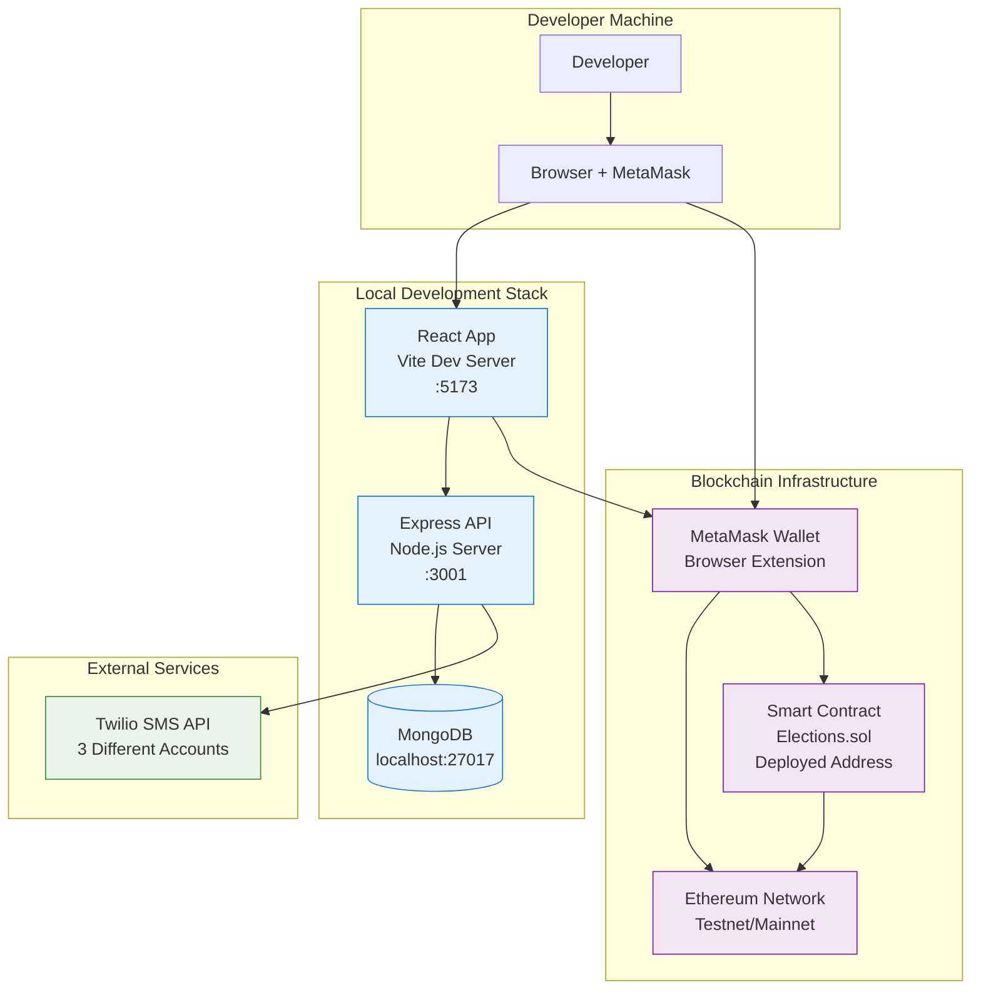

# Whole-System Integration Report

## 1) End-to-End Workflow Analysis

### Critical Flow 1: Complete Voter Journey

**Narrative**: User registers, authenticates, votes, and views results

**Step-by-Step Breakdown**:

1. **Landing & Navigation** (`/` → `/voterLogin`)
   - User accesses landing page via browser
   - Clicks "Voter Login" in NavBar component
   - React Router navigates to VoterLogin page

2. **Two-Phase Authentication** (`VoterLoginComponent`)
   - **Phase 1**: Aadhaar Input + OTP Request
     - User enters 12-digit Aadhaar number
     - Frontend validates format, sends `POST /api/validateVoter` to backend
     - Backend queries MongoDB `voters` collection by Aadhaar
     - Backend generates 6-digit OTP, selects Twilio account by phone mapping
     - Twilio SMS API sends OTP to registered phone number
     - Backend stores OTP + timestamp in user record
   - **Phase 2**: OTP Verification + Profile Return
     - User enters received OTP code
     - Frontend sends `POST /api/verifyCode` with Aadhaar + OTP
     - Backend validates OTP, returns user profile data
     - Frontend stores complete profile in `localStorage.voterData`
     - Automatic redirect to `/voterDashboard`

3. **Dashboard Access** (`VoterDashboard` → `VoteNow`)
   - `VoterPrivateRoute` checks `localStorage.voterData.isLogin`
   - Dashboard renders with sidebar navigation
   - User clicks "Vote Now" → loads `VoteNow` component
   - Component triggers blockchain connection sequence

4. **Blockchain Voting Process** (`VoteNow` + Smart Contract)
   - **Connection Phase**:
     - `connectToBlockchain()` requests MetaMask wallet connection
     - User approves wallet connection in MetaMask popup
     - Web3 initializes contract instance with ABI + contract address
   - **Data Loading Phase**:
     ```javascript
     // Parallel blockchain queries
     candidates = await getCandidates()          // Fetch all candidates
     electionStarted = await isElectionStarted() // Check election status
     userVoted = await checkIfVoted(aadhaar)     // Check if user voted
     resultsDeclared = await resultStatus()      // Check results status
     ```
   - **Voting Phase** (if eligible):
     - User clicks "Vote Now" on selected candidate
     - Frontend calls `addVote(candidateId, aadhaarNumber)`
     - MetaMask shows transaction confirmation with gas fees
     - User approves → MetaMask submits transaction to blockchain
     - Smart contract validates: wallet hasn't voted + Aadhaar not used
     - On success: vote recorded, candidate count incremented
     - Frontend updates UI state, hides voting buttons

5. **Results Display** (post-election)
   - Admin calls `declareResults()` via admin dashboard
   - Smart contract calculates winner (max votes)
   - All users can view winner via `getWinner()` call
   - Results display with vote counts and winner announcement

### Critical Flow 2: Admin Election Management

**Narrative**: Admin sets up election, manages candidates, controls election lifecycle

**Step-by-Step Breakdown**:

1. **Admin Authentication** (`AdminLoginComponent`)
   - Admin enters username/password
   - Frontend sends `GET /api/validateAdmin/{name}/{pass}` (⚠️ security risk)
   - Backend queries MongoDB `admin` collection with plaintext comparison
   - On success: profile stored in `localStorage.adminData`, redirect to dashboard

2. **Pre-Election Setup** (`AdminDashboard`)
   - **Add Candidates** (`AddCandidate` component):
     - Admin fills form: candidate name, party name, party logo URL
     - Frontend validates inputs (URL format, required fields)
     - Calls `addCandidate(name, party, logo)` → smart contract
     - MetaMask transaction to add candidate to blockchain storage
   - **Verify Setup** (`AllCandidates` component):
     - Admin reviews candidate list via `getCandidates()` call
     - Ensures all candidates properly configured

3. **Election Control** (`Controls` component):
   - **Start Election**:
     - Admin clicks "Start Election" button
     - Calls `startElection()` → smart contract
     - Contract verifies `msg.sender == owner` (admin wallet)
     - Sets `electionStarted = true`, enables voting for all users
   - **Monitor Election**:
     - Real-time status via `isElectionStarted()` and `resultStatus()`
     - Admin can track progress (no vote count visibility during election)
   - **Declare Results**:
     - Admin clicks "Declare Results" when voting period ends
     - Calls `declareResults()` → smart contract
     - Contract calculates winner, sets `isResultDeclared = true`
     - Returns winner data, ends election

### Critical Flow 3: System-Wide State Synchronization

**Narrative**: How system maintains consistency across users during election

**State Synchronization Points**:

1. **Election Status Propagation**:
   - Admin starts election → smart contract state change
   - All voter dashboards check `isElectionStarted()` on component load
   - Manual refresh required for status updates (no real-time sync)

2. **Vote Count Updates**:
   - Each vote increments candidate vote count in smart contract
   - Vote counts only visible after results declared
   - No real-time vote tallies during active election

3. **Result Declaration**:
   - Admin declares results → contract calculates winner
   - All users can immediately access winner via `getWinner()`
   - Results cached in localStorage for performance

## 2) Deployment Topology

### Current Development Architecture



### Production Deployment Gaps

**Missing Infrastructure Components**:

| Component | Current State | Production Requirement |
|-----------|---------------|----------------------|
| **Web Server** | Vite dev server | Nginx/Apache + static files |
| **API Server** | Node.js development | PM2/Docker + load balancer |
| **Database** | Local MongoDB | MongoDB Atlas/self-hosted cluster |
| **Smart Contract** | Manual deployment | Automated deployment pipeline |
| **SSL/TLS** | HTTP only | HTTPS certificates |
| **CDN** | Local assets | CloudFront/CloudFlare |
| **Monitoring** | Console logs | Centralized logging + metrics |
| **Backup** | None | Database + wallet backup strategy |

### Environment Configuration Needs

```bash
# Backend Production Environment
PORT=3001
MONGO_URI=mongodb+srv://cluster.mongodb.net/voting
TWILIO_ACCOUNT_SID_1=AC...
TWILIO_AUTH_TOKEN_1=...
TWILIO_PHONE_NUMBER_1=+1...
# (repeat for accounts 2,3)
NODE_ENV=production

# Frontend Production Environment  
VITE_CONTRACT_ADDRESS=0x742d35cc6...
VITE_API_BASE_URL=https://api.yourdomain.com
VITE_NETWORK_ID=1  # Mainnet
```

## 3) Reliability & Observability

### Current Logging & Monitoring

**Backend Logging**:
- **Level**: Basic `console.error()` and `console.log()`
- **Location**: Route handlers only (`OTPAuth.js:46,72`, `validateAdmin.js:15`)
- **Format**: Unstructured error messages
- **Storage**: Terminal output only (lost on restart)

**Frontend Logging**:
- **Level**: `console.error()` in catch blocks
- **User Feedback**: `alert()` popups for errors
- **State Tracking**: No error tracking or analytics
- **Performance**: No bundle size or loading time monitoring

**Smart Contract Events**:
- **No Event Emission**: Contract doesn't emit events for vote tracking
- **No Indexing**: No event indexing for analytics
- **Transaction Monitoring**: Relies on MetaMask transaction status only

### Health Checks & Readiness

**Current State**: ❌ None implemented

**Production Requirements**:
```javascript
// Backend Health Check Endpoints
GET /health/live    // Basic server responsiveness
GET /health/ready   // Database + external service connectivity
GET /health/deep    // Full system health including blockchain
```

### Missing Observability Features

| Category | Missing Components | Impact |
|----------|-------------------|--------|
| **Application Monitoring** | Error tracking (Sentry), APM (DataDog) | No visibility into production issues |
| **Infrastructure Monitoring** | Server metrics, database performance | No scaling insights |
| **User Analytics** | Usage tracking, conversion funnels | No product improvement data |
| **Blockchain Monitoring** | Transaction tracking, gas optimization | No cost optimization |
| **Security Monitoring** | Audit logs, anomaly detection | No security incident detection |

## 4) Gaps & Improvements (Prioritized)

### 🔴 Critical Security Fixes (Immediate)

| Issue | Fix | Effort | Impact |
|-------|-----|---------|--------|
| **Admin Plaintext Passwords** | Hash with bcrypt, move to POST body | 4 hours | Prevents credential theft |
| **No Input Validation** | Add joi/express-validator middleware | 8 hours | Prevents injection attacks |
| **Open CORS Policy** | Restrict to specific domains | 1 hour | Reduces XSS risk |
| **No Rate Limiting** | Add express-rate-limit | 2 hours | Prevents OTP spam |

**Code Examples**:
```javascript
// Backend: Hash admin passwords
const bcrypt = require('bcrypt');
const hashedPassword = await bcrypt.hash(password, 10);

// Backend: Input validation middleware
const joi = require('joi');
const voterSchema = joi.object({
  aadhar: joi.string().length(12).pattern(/^[0-9]+$/).required()
});

// Frontend: Environment-based API URLs
const API_BASE_URL = import.meta.env.VITE_API_BASE_URL || 'http://localhost:3001';
```

### 🟡 High-Impact Technical Debt (1-2 weeks)

| Component | Improvement | Effort | Benefit |
|-----------|-------------|---------|---------|
| **Frontend State Management** | Redux Toolkit or Zustand | 16 hours | Centralized state, better debugging |
| **API Client** | Axios with interceptors | 8 hours | Error handling, retry logic |
| **Error Boundaries** | React error boundaries | 4 hours | Graceful failure handling |
| **Database Models** | Mongoose schemas | 8 hours | Data validation, relationships |

### 🟢 Performance & UX Improvements (2-4 weeks)

| Feature | Implementation | Effort | User Benefit |
|---------|----------------|---------|--------------|
| **Real-time Updates** | WebSocket for election status | 16 hours | Live status without refresh |
| **Loading States** | Skeleton screens, spinners | 8 hours | Better perceived performance |
| **Code Splitting** | React.lazy, route-based splitting | 8 hours | Faster initial load |
| **Smart Contract Events** | Event emission + frontend listening | 12 hours | Real-time vote confirmation |

### 🔵 Infrastructure & DevOps (3-6 weeks)

| Component | Setup | Effort | Operational Benefit |
|-----------|-------|---------|-------------------|
| **Docker Containerization** | Multi-stage builds | 12 hours | Consistent deployments |
| **CI/CD Pipeline** | GitHub Actions | 16 hours | Automated testing & deployment |
| **Monitoring Stack** | Prometheus + Grafana | 20 hours | Production visibility |
| **Test Infrastructure** | Jest + RTL + E2E | 24 hours | Quality assurance |

## 5) Production Runbook

### Prerequisites
```bash
# System Requirements
Node.js >= 18.0.0
MongoDB >= 5.0
MetaMask browser extension
Ethereum testnet access (Goerli/Sepolia)

# Development Tools
Git
npm/yarn
Code editor (VS Code recommended)
```

### One-Screen Setup & Run

```bash
# 1. Clone and Navigate
git clone https://github.com/dexter-ifti/blockchain-voting-system.git
cd blockchain-voting-system

# 2. Backend Setup
cd backend
npm install
# Create .env file with MongoDB and Twilio credentials
echo "MONGO_URI=mongodb://localhost:27017/voting" > .env
echo "TWILIO_ACCOUNT_SID_1=your_sid" >> .env
echo "TWILIO_AUTH_TOKEN_1=your_token" >> .env
echo "TWILIO_PHONE_NUMBER_1=your_number" >> .env
npm start  # Runs on http://localhost:3001

# 3. Database Setup
# Ensure MongoDB is running
# Manually insert admin and voter records:
# db.admin.insertOne({uname: "admin", pass: "password", name: "Admin", phone: "123"})
# db.voters.insertOne({aadhar: "123456789012", phone: "+1234567890", name: "Test User", uname: "test@email.com", dob: "1990-01-01"})

# 4. Smart Contract Deployment
# Deploy Elections.sol using Remix IDE or Truffle
# Note contract address for frontend configuration

# 5. Frontend Setup
cd ../frontend
npm install
# Set environment variable for contract address
export VITE_CONTRACT_ADDRESS=0x742d35cc6df32c6ac1b26c22ae1c4c4a7be43de5
npm run dev  # Runs on http://localhost:5173

# 6. Access Application
# Frontend: http://localhost:5173
# Backend API: http://localhost:3001/api
# Test admin login: admin/password
# Test voter login: requires registered Aadhaar in database
```

### Common Development Pitfalls

| Issue | Symptom | Solution |
|-------|---------|----------|
| **MetaMask Not Connected** | "Please install MetaMask" error | Refresh page, ensure MetaMask installed |
| **Wrong Network** | Transaction failures | Switch MetaMask to correct network |
| **OTP Not Received** | Authentication failure | Check Twilio credentials and phone mapping |
| **Contract Address Invalid** | Web3 connection errors | Verify VITE_CONTRACT_ADDRESS is set correctly |
| **MongoDB Connection** | Backend startup failure | Ensure MongoDB running on port 27017 |
| **CORS Errors** | API call failures from frontend | Verify backend CORS configuration |

### Production Deployment Commands

```bash
# Backend Production Build
cd backend
npm ci --production
pm2 start app.js --name voting-backend

# Frontend Production Build  
cd frontend
npm ci
npm run build
# Serve dist/ folder with Nginx/Apache

# Database Migration (if implemented)
npx migrate up

# Health Check
curl http://localhost:3001/api/health
curl http://your-domain.com/health
```

### Monitoring & Maintenance

```bash
# Backend Logs
pm2 logs voting-backend
tail -f /var/log/nginx/access.log

# Database Health
mongosh
db.stats()
db.voters.countDocuments()

# Smart Contract Status
# Use blockchain explorer (Etherscan) to verify contract interactions
```

---

## System Integration Summary

### Architecture Strengths
- ✅ **Clear Separation**: Frontend (auth/UI) ↔ Backend (auth API) ↔ Blockchain (voting logic)
- ✅ **User Experience**: Intuitive flow from authentication to voting
- ✅ **Immutable Voting**: Blockchain ensures tamper-proof vote storage
- ✅ **Multi-Modal Auth**: Combines traditional (OTP) with Web3 (wallet) authentication

### Critical Integration Points
1. **localStorage Bridge**: Connects backend auth with frontend state
2. **MetaMask Interface**: Links React UI with blockchain transactions  
3. **Smart Contract State**: Centralized election control and vote storage
4. **Twilio SMS**: External service for OTP delivery

### System-Wide Risk Assessment
- 🔴 **Single Points of Failure**: MongoDB, Twilio accounts, contract owner wallet
- 🔴 **No Disaster Recovery**: No backup or failover mechanisms
- 🟡 **Scalability Limits**: No load balancing or horizontal scaling
- 🟡 **Security Gaps**: Multiple vulnerabilities across all layers

### Production Readiness Score: 3/10
**Ready for**: Internal demos, proof-of-concept
**Needs work for**: Public elections, production deployment

**Top 5 priorities before production**:
1. Security audit and vulnerability fixes
2. Comprehensive testing strategy  
3. Monitoring and logging infrastructure
4. Database backup and recovery
5. Smart contract security audit
